# IoT Platform 数据库ER图

## Mermaid ER图

```mermaid
erDiagram
    %% ==================== 系统管理 ====================
    sys_user {
        bigint id PK "用户ID 自增"
        varchar username UK "用户名 唯一"
        varchar password "密码 BCrypt加密"
        varchar nickname "显示名称"
        varchar role "角色 admin"
        tinyint enabled "是否启用 1/0"
        datetime last_login_time "最后登录时间"
        datetime created_time "创建时间"
        datetime updated_time "更新时间"
    }

    %% ==================== 产品与物模型 ====================
    product {
        varchar id PK "产品ID 如 P_xxxxxxxx"
        varchar name "产品名称"
        varchar type "产品类型 sensor/actuator"
        varchar description "产品描述"
        datetime created_time "创建时间"
        datetime updated_time "更新时间"
    }

    thing_property {
        varchar id PK "属性ID 如 PROP_xxxxxxxx"
        varchar product_id FK "所属产品ID"
        varchar name "属性名称 如 温度"
        varchar identifier UK "属性标识符 如 temperature"
        varchar data_type "数据类型 int/double/boolean/string"
        varchar min_value "最小值"
        varchar max_value "最大值"
        varchar unit "单位 ℃/%"
        varchar access_mode "权限 read/read_write"
        datetime created_time "创建时间"
        datetime updated_time "更新时间"
    }

    thing_service {
        varchar id PK "服务ID 如 SVC_xxxxxxxx"
        varchar product_id FK "所属产品ID"
        varchar name "服务名称 如 开关控制"
        varchar identifier UK "服务标识符 如 setSwitch"
        text input_params "输入参数JSON"
        text output_params "输出参数JSON"
        varchar description "服务描述"
        datetime created_time "创建时间"
        datetime updated_time "更新时间"
    }

    thing_event {
        varchar id PK "事件ID 如 EVT_xxxxxxxx"
        varchar product_id FK "所属产品ID"
        varchar name "事件名称 如 高温事件"
        varchar identifier UK "事件标识符 如 highTemperature"
        varchar event_type "事件类型 info/warn/error"
        varchar description "事件描述"
        datetime created_time "创建时间"
        datetime updated_time "更新时间"
    }

    %% ==================== 设备 ====================
    device {
        varchar device_id PK "设备ID 如 DVC_xxxxxxxx"
        varchar product_id FK "所属产品ID"
        varchar node_id UK "设备物理标识 IMEI/MAC"
        varchar device_name "设备名称"
        varchar location "设备位置"
        varchar secret "MQTT连接密钥"
        varchar status "在线状态 online/offline"
        datetime last_online_time "最后上线时间"
        datetime activated_time "首次激活时间"
        datetime created_time "注册时间"
        datetime updated_time "更新时间"
    }

    %% ==================== 设备影子 ====================
    device_shadow {
        varchar device_id PK "设备ID 一对一"
        json shadow_data "影子JSON reported/desired/delta"
        int version "版本号 乐观锁"
        datetime updated_time "更新时间"
    }

    device_shadow_log {
        bigint id PK "日志ID 自增"
        varchar device_id FK "设备ID"
        int version "变更后版本号"
        varchar change_type "变更类型 reported/desired/delta"
        json before_state "变更前状态JSON"
        json after_state "变更后状态JSON"
        datetime created_time "变更时间"
    }

    %% ==================== 遥测数据 ====================
    telemetry_latest {
        varchar device_id PK "设备ID 最新值"
        varchar product_id FK "产品ID"
        json payload "最新属性JSON"
        datetime reported_time "上报时间"
    }

    telemetry_record {
        bigint id PK "记录ID 自增"
        varchar device_id FK "设备ID"
        varchar product_id FK "产品ID"
        json payload "属性JSON"
        datetime reported_time "上报时间"
    }

    %% ==================== 日志记录 ====================
    device_connect_log {
        bigint id PK "日志ID 自增"
        varchar device_id FK "设备ID"
        varchar event_type "事件类型 online/offline/auth_failed"
        datetime event_time "事件时间"
        varchar client_id "MQTT ClientID"
        varchar reason "原因说明"
    }

    device_event_log {
        bigint id PK "事件ID 自增"
        varchar device_id FK "设备ID"
        varchar product_id FK "产品ID"
        varchar event_identifier "事件标识符"
        varchar event_type "事件类型 info/warn/error"
        json payload "事件内容JSON"
        datetime event_time "事件时间"
    }

    command_log {
        bigint id PK "记录ID 自增"
        varchar command_id UK "命令业务ID 如 CMD_xxxxxxxx"
        varchar device_id FK "设备ID"
        varchar service_identifier "服务标识符"
        varchar command_name "命令名称"
        json command_params "命令参数JSON"
        varchar status "状态 pending/success/failed/timeout"
        json result "执行结果JSON"
        datetime request_time "下发时间"
        datetime response_time "响应时间"
    }

    %% ==================== 告警 ====================
    alert_rule {
        varchar id PK "规则ID 如 RULE_xxxxxxxx"
        varchar product_id FK "产品ID"
        varchar property_identifier "属性标识符"
        varchar operator "运算符 >/>= /</<= /==/!="
        varchar threshold "阈值"
        varchar alert_content "告警内容"
        tinyint enabled "是否启用 1/0"
        datetime created_time "创建时间"
        datetime updated_time "更新时间"
    }

    alert_record {
        bigint id PK "告警ID 自增"
        varchar device_id FK "设备ID"
        varchar product_id FK "产品ID"
        varchar rule_id FK "规则ID 可为NULL"
        varchar property_identifier "触发属性"
        varchar actual_value "实际值"
        varchar alert_content "告警内容"
        varchar status "状态 pending/confirmed"
        datetime alert_time "告警时间"
        datetime confirmed_time "确认时间"
        varchar remark "确认备注"
    }

    %% ==================== 关系定义 ====================

    %% 产品 一对多 物模型
    product ||--o{ thing_property : "定义属性"
    product ||--o{ thing_service : "定义服务"
    product ||--o{ thing_event : "定义事件"

    %% 产品 一对多 设备
    product ||--o{ device : "包含设备"

    %% 设备 一对一 影子
    device ||--|| device_shadow : "拥有影子"
    device ||--o{ device_shadow_log : "影子变更记录"

    %% 设备 一对多 遥测
    device ||--|| telemetry_latest : "最新遥测"
    device ||--o{ telemetry_record : "遥测历史"

    %% 设备 一对多 日志
    device ||--o{ device_connect_log : "上下线记录"
    device ||--o{ device_event_log : "事件日志"
    device ||--o{ command_log : "命令记录"

    %% 产品 一对多 告警规则
    product ||--o{ alert_rule : "配置规则"

    %% 告警规则 一对多 告警记录
    alert_rule ||--o{ alert_record : "触发记录"

    %% 设备 一对多 告警记录
    device ||--o{ alert_record : "设备告警"
```



## 表关系说明

### 核心实体关系

```
sys_user (独立)
    └── 系统管理员，BCrypt密码存储

product (核心)
    ├── 1:N → thing_property    物模型属性定义
    ├── 1:N → thing_service     物模型服务定义
    ├── 1:N → thing_event       物模型事件定义
    ├── 1:N → device            设备实例
    └── 1:N → alert_rule        告警规则

device (核心)
    ├── N:1 → product           所属产品
    ├── 1:1 → device_shadow     设备影子 (JSON文档)
    ├── 1:N → device_shadow_log 影子变更审计
    ├── 1:1 → telemetry_latest  最新遥测数据
    ├── 1:N → telemetry_record  遥测历史
    ├── 1:N → device_connect_log 上下线记录
    ├── 1:N → device_event_log  设备事件
    ├── 1:N → command_log       命令记录
    └── 1:N → alert_record      告警记录

alert_rule
    ├── N:1 → product           所属产品
    └── 1:N → alert_record      触发的告警

alert_record
    ├── N:1 → device            触发设备
    ├── N:1 → product           所属产品
    └── N:1 → alert_rule        触发规则 (SET NULL)
```

### 外键删除策略

| 关系 | 策略 | 说明 |
|------|------|------|
| product → thing_property/service/event/device/alert_rule | CASCADE | 删除产品时级联删除所有关联数据 |
| device → shadow/telemetry/logs/command/alert_record | CASCADE | 删除设备时级联删除所有关联数据 |
| alert_rule → alert_record | SET NULL | 删除规则时告警记录保留，rule_id置空 |

### 唯一约束

| 表 | 约束 | 字段 |
|----|------|------|
| sys_user | uk_username | username |
| thing_property | uk_property_identifier | (product_id, identifier) |
| thing_service | uk_service_identifier | (product_id, identifier) |
| thing_event | uk_event_identifier | (product_id, identifier) |
| device | uk_node_id | node_id |
| command_log | uk_command_id | command_id |

### 索引设计

| 表 | 索引 | 用途 |
|----|------|------|
| device | idx_product_id, idx_status | 按产品查设备、按状态筛选 |
| telemetry_record | idx_device_time, idx_product_time | 遥测历史查询 |
| device_connect_log | idx_device_time, idx_event_time | 上下线记录查询 |
| command_log | idx_device_time, idx_status | 命令记录查询 |
| alert_rule | idx_product_id, idx_enabled | 按产品查规则、启用筛选 |
| alert_record | idx_device_time, idx_status, idx_alert_time | 告警记录多维查询 |
| device_event_log | idx_device_time, idx_product_time | 事件日志查询 |

### JSON字段结构

**device_shadow.shadow_data:**
```json
{
  "version": 5,
  "state": {
    "reported": { "temperature": 25.5, "humidity": 60 },
    "desired": { "temperature": 22.0 }
  },
  "delta": { "temperature": 22.0 }
}
```

**telemetry_latest.payload / telemetry_record.payload:**
```json
{ "temperature": 25.5, "humidity": 60 }
```

**command_log.command_params:**
```json
{ "brightness": 80 }
```

**command_log.result:**
```json
{ "message": "brightness updated" }
```
